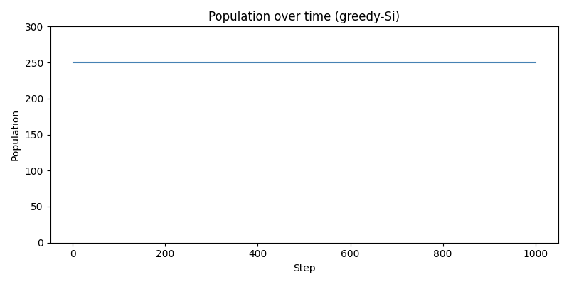
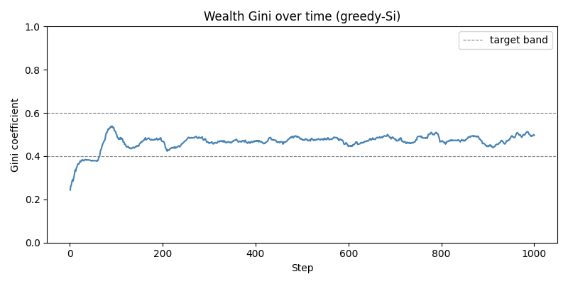
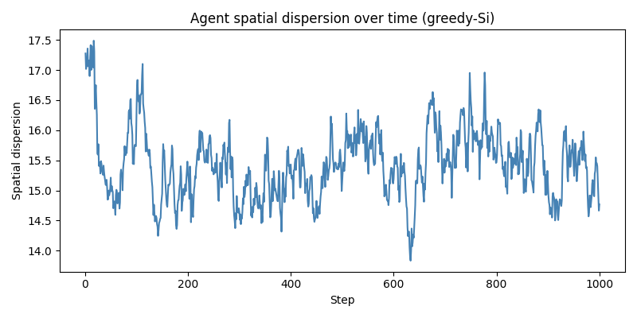
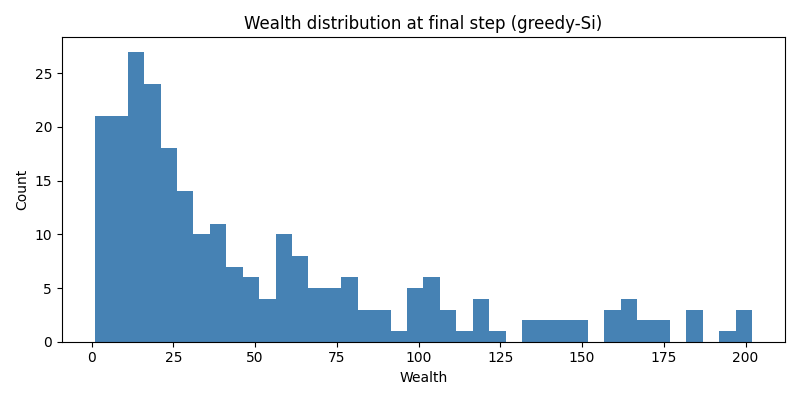
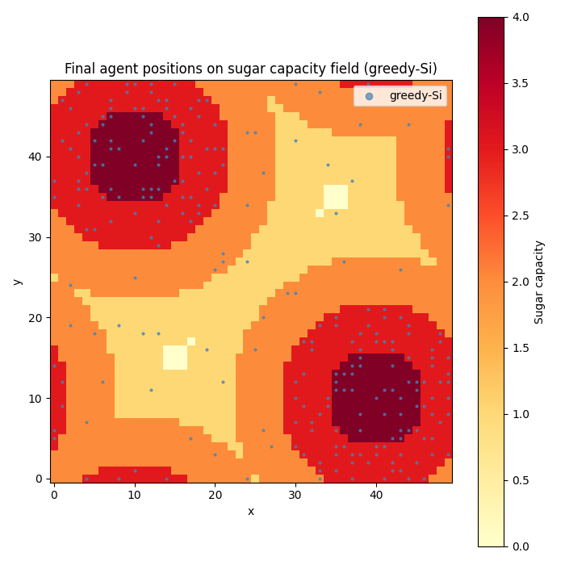

# Run report: stage1_baseline_seed42

**Seed:** 42 | **Steps:** 1000 | **Strategy:** greedy | **Date:** 2026-05-16

## TL;DR
- [✓] All success criteria met
- Final population: 250 | Final Gini: 0.48 | Mean dispersion: 15.2

## Success criteria
| Criterion | Status | Observed | Threshold |
|---|---|---|---|
| Population stable | ✓ | 250–250 | [200, 300] |
| Gini in [0.4, 0.6] | ✓ | 0.48 ± 0.022 | [0.4, 0.6] |
| Agents near peaks (>50%) | ✓ | 61% | >50% |
| Reproducibility (same seed) | ✓ | identical trace | identical |

## Key metrics (final 100 steps, mean ± std)
| Metric | Value |
|---|---|
| Population | 250.0 ± 0.0 |
| Mean wealth | 52.3 ± 2.2 |
| Gini wealth | 0.48 ± 0.022 |
| Spatial dispersion | 15.2 ± 0.43 |
| Deaths/step (starvation) | 1.6 |
| Deaths/step (senescence) | 2.9 |


## Plots







## Notes
_No anomalies to report._

## Configuration
```yaml
agents:
  initial_population: 250
  initial_wealth_dist:
  - 5
  - 25
  max_age_dist:
  - 60
  - 100
  metabolic_rate_dist:
  - 1
  - 4
  phi_mean: 0.5
  phi_std: 0.2
  vision_dist:
  - 1
  - 6
carbon:
  cred_bonus_per_participant: 1.0
  cred_decay: 0.01
  cred_scale: 10.0
  epsilon: 0.01
  kappa: 2.0
  matthew_alpha: 1.5
  sigma_base: 0.5
  velocity_scale: 1.0
  velocity_tau: 10
decision:
  strategy: greedy
joint_task:
  capacity_threshold: 4
  distance_d: 1
run:
  c_reference_dir: ''
  metrics_every: 1
  n_steps: 1000
  output_dir: outputs/stage1_baseline_seed42
  si_reference_dir: ''
seed: 42
visualization:
  animate: true
  frames_per_save: 5
  save_static_plots: true
world:
  band_width_k: 6
  grid_size:
  - 50
  - 50
  growth_rate_alpha: 1
  max_sugar_capacity: 4
  sugar_peaks:
  - - 10
    - 40
  - - 40
    - 10
  toroidal: true
```
