# Run report: stage2_carbon_noswitch_seed42

**Seed:** 42 | **Steps:** 1000 | **Strategy:** carbon | **Date:** 2026-05-16

## TL;DR
- [✓] All success criteria met
- Final population: 250 | Final Gini: 0.45 | Mean dispersion: 17.8

## Success criteria
| Criterion | Status | Observed | Threshold |
|---|---|---|---|
| C population stable | ✓ | 250–250 | [200, 300] |
| Joint tasks firing (mean > 0 after step 100) | ✓ | 31.62/step | > 0 |
| Cred accumulating + stable (mean_cred > 0, gini_cred std < 0.05) | ✓ | mean_cred=7.141, gini_cred_std=0.0116 | mean_cred > 0 and std < 0.05 |
| No Cred monopoly (max_cred_fraction < 0.5 after t=100) | ✓ | max observed: 0.149 | < 0.5 |
| sigma > sigma_base (0.5) at steady state | ✓ | 0.9632 | > 0.5 |
| All new pytest tests pass | ✓ | pytest passed | all pass |
| Reproducibility (same seed) | ✓ | identical trace | identical |

## Key metrics (final 100 steps, mean ± std)
| Metric | Value |
|---|---|
| Population | 250.0 ± 0.0 |
| Mean wealth | 45.8 ± 1.7 |
| Gini wealth | 0.45 ± 0.013 |
| Spatial dispersion | 17.8 ± 1.04 |
| Deaths/step (starvation) | 2.9 |
| Deaths/step (senescence) | 2.5 |

### Stage 2 — Cred and joint-task metrics (final 100 steps)
| Metric | Value |
|---|---|
| Mean Cred | 7.141 ± 0.758 |
| Gini Cred | 0.856 ± 0.012 |
| Max Cred fraction | 0.094 |
| Mean sigma | 0.963 ± 0.019 |
| Joint tasks/step | 31.06 |
| Joint participants/step | 66.91 |

## Plots
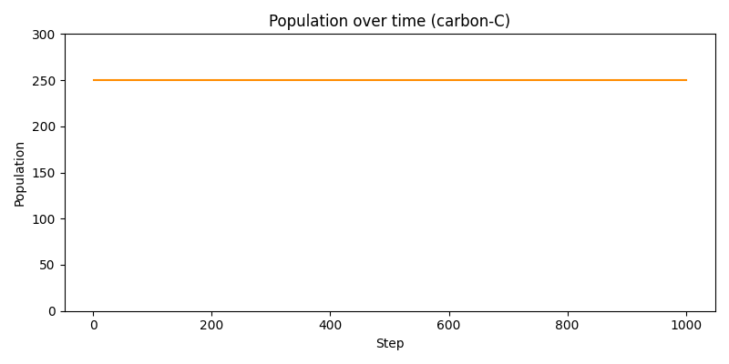
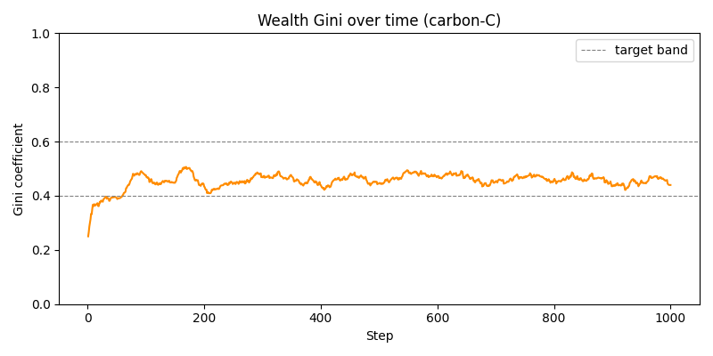
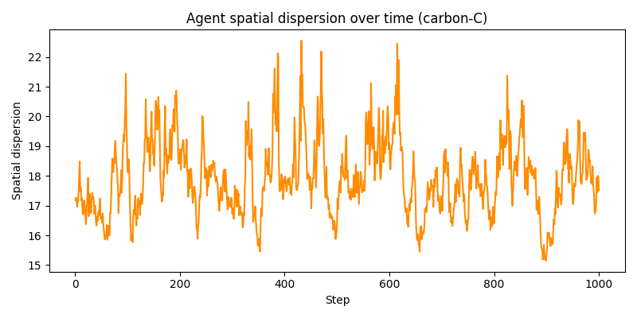
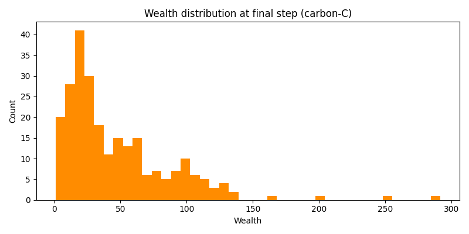
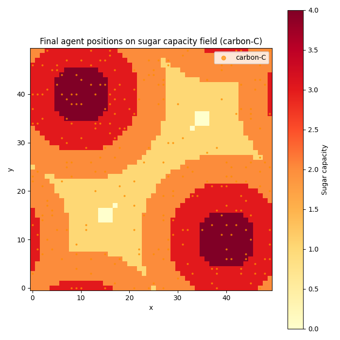
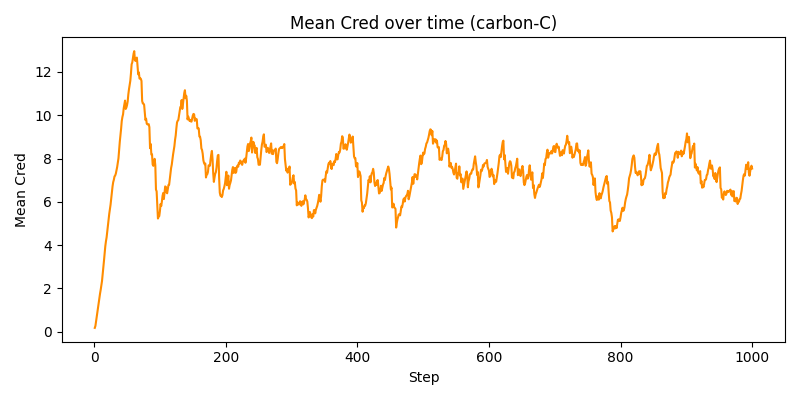
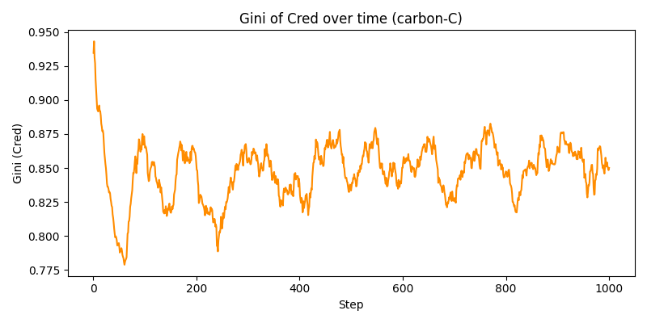
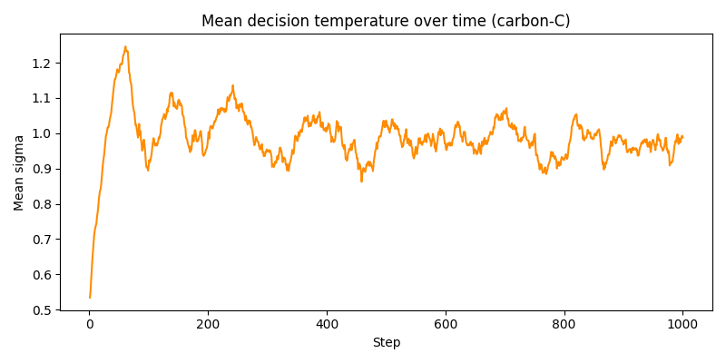
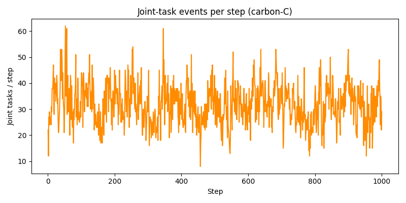

### Si vs C overlay plots
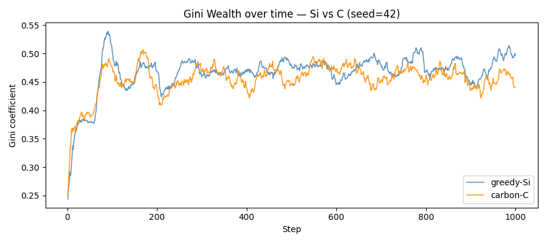
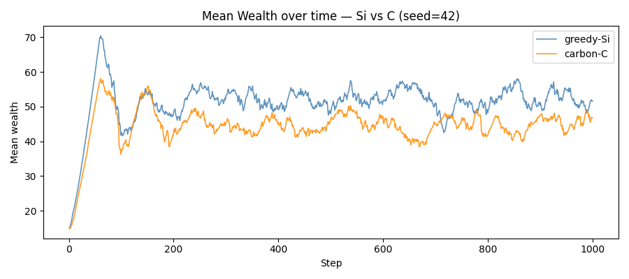
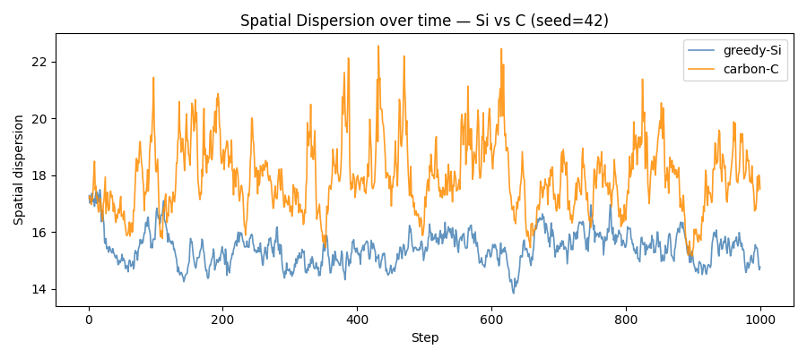
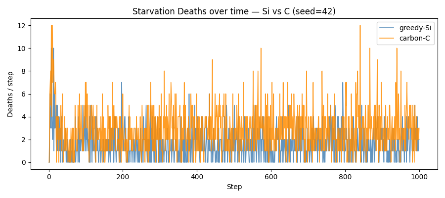

## Comparison to Stage 1 (greedy-Si, same seed)
| Metric (final 100 steps) | Stage 1 (Si) | Stage 2 (C) | Δ |
|---|---|---|---|
| Mean wealth | 52.3 | 45.8 | -6.47 |
| Gini wealth | 0.47 | 0.45 | -0.02 |
| Spatial dispersion | 15.5 | 17.8 | +2.26 |
| Deaths/step (starvation) | 1.8 | 2.9 | +1.10 |
| Deaths/step (senescence) | 2.8 | 2.5 | -0.29 |
| Mean Cred | — | 7.141 | — |
| Gini Cred | — | 0.856 | — |
| Joint tasks/step | — | 31.06 | — |

## Notes
_No anomalies to report._

## Configuration
```yaml
agents:
  initial_population: 250
  initial_wealth_dist:
  - 5
  - 25
  max_age_dist:
  - 60
  - 100
  metabolic_rate_dist:
  - 1
  - 4
  phi_mean: 0.5
  phi_std: 0.2
  vision_dist:
  - 1
  - 6
carbon:
  cred_bonus_per_participant: 1.0
  cred_decay: 0.01
  cred_scale: 10.0
  epsilon: 0.01
  kappa: 2.0
  matthew_alpha: 1.5
  sigma_base: 0.5
  velocity_scale: 1.0
  velocity_tau: 0
decision:
  strategy: carbon
joint_task:
  capacity_threshold: 4
  distance_d: 1
run:
  c_reference_dir: ''
  metrics_every: 1
  n_steps: 1000
  output_dir: outputs/stage2_carbon_noswitch_seed42
  si_reference_dir: outputs/stage1_baseline_seed42
seed: 42
visualization:
  animate: false
  frames_per_save: 5
  save_static_plots: true
world:
  band_width_k: 6
  grid_size:
  - 50
  - 50
  growth_rate_alpha: 1
  max_sugar_capacity: 4
  sugar_peaks:
  - - 10
    - 40
  - - 40
    - 10
  toroidal: true
```
