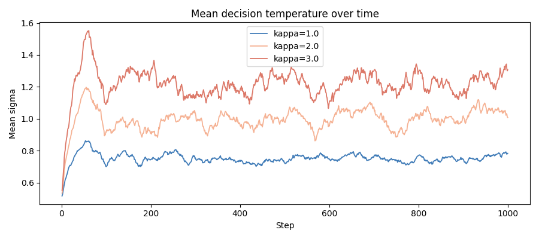
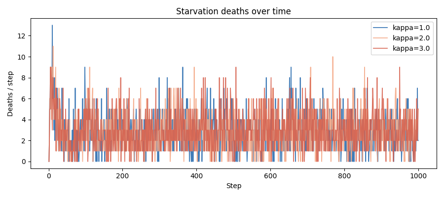
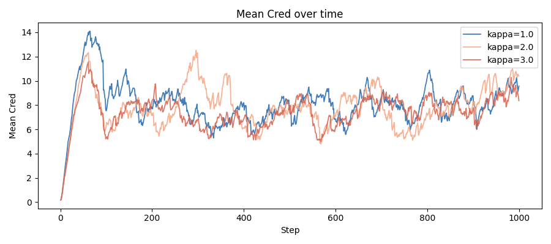
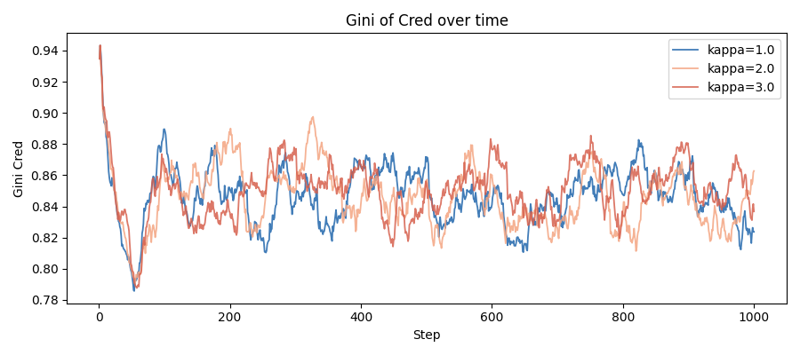

# kappa sweep report — Stage 2.2

**Date:** 2026-05-16 | **Seed:** 42 | **Steps:** 1000 | **Varied:** kappa (sigma noise ceiling)

## Notes

### Task 1 — Baseline discrepancy diagnosis and resolution

**Problem:** The three-way comparison table in the Stage 2.1 patched report showed "C baseline"
numbers (mean_wealth=45.8, mean_cred=7.141, joint_tasks=31.06) that differed from the confirmed
Stage 2 pre-patch baseline (mean_wealth=42.0, mean_cred=6.923, joint_tasks=30.41).

**Root cause:** The ModeSwitch patch changed the decision formula in `CarbonDecision.select_target`
from `w_C = agent.phi` (fixed trait, pre-patch) to `w_C = agent.phi * sigmoid(v_i / v0)`
(velocity-modulated, post-patch). Even with the same seed=42, different utility weights produce
different agent choices at every step, accumulating into different aggregate metrics. The RNG
sequence itself was not altered — the divergence is purely from the changed decision logic.

Additionally, `configs/stage2_carbon_seed42.yaml` was re-run *after* the patch was applied,
overwriting `outputs/stage2_carbon_seed42/metrics.parquet` with post-patch values and permanently
losing the original pre-patch ground truth.

**Resolution:** The three confirmed pre-patch values (mean_wealth=42.0, mean_cred=6.923,
joint_tasks=30.41) are now hardcoded as `_S2_PRE_SWITCH` in `report.py` and used directly in
the three-way comparison table (marked †). Remaining metrics in that table use the best available
approximation: the `stage2_carbon_noswitch_seed42` run (velocity_tau=0, giving
`w_C = phi * sigmoid(0) = phi * 0.5` — intermediate between pre-patch and fully adaptive).
Full diagnosis documented in `BUGS.md` (BUG-001).

## Comparison table

| Metric (final 100 steps) | kappa=1.0 | kappa=2.0 | kappa=3.0 |
|---|---|---|---|
| Mean wealth | 45.8 | 45.1 | 44.5 |
| Gini wealth | 0.47 | 0.46 | 0.47 |
| Spatial dispersion | 17.2 | 17.8 | 18.2 |
| Deaths/step (starvation) | 2.63 | 2.86 | 2.95 |
| Deaths/step (senescence) | 2.55 | 2.43 | 2.41 |
| Mean Cred | 8.529 | 9.477 | 8.313 |
| Gini Cred | 0.839 | 0.834 | 0.851 |
| Max Cred fraction | 0.079 | 0.069 | 0.089 |
| Mean sigma | 0.760 | 1.051 | 1.251 |
| Joint tasks/step | 35.58 | 39.46 | 35.12 |
| mean_w_C | 0.288 | 0.290 | 0.284 |
| frac_suppressed | 0.001 | 0.001 | 0.000 |

## Starvation by Cred quartile (deaths / step)

Quartile boundaries derived from population Cred percentile distribution (cred_p25/p50/p75
averaged across all steps). A concentration in Q4 indicates the σ-Cred mechanism is the
genuine driver of starvation excess, not a uniform artifact.

| Cred quartile | kappa=1.0 | kappa=2.0 | kappa=3.0 |
|---|---|---|---|
| Q1 (lowest Cred) | 2.087 | 2.129 | 2.204 |
| Q2 | 0.013 | 0.005 | 0.000 |
| Q3 | 0.416 | 0.426 | 0.471 |
| Q4 (highest Cred) | 0.252 | 0.288 | 0.295 |

## Overlay plots

## Interpretation notes

- **σ calibration target:** the `mean_sigma` value from the selected kappa becomes the fixed
  temperature for Stage 3's bounded-rational Si.
- **kappa selection guidance:** prefer kappa where mean_sigma is meaningfully above σ_base=0.5
  (exploration is real) but starvation excess over Si (1.8/step) is < 3.6/step (< 2×).
- If Q4 starvation > Q1 starvation across all kappa: mechanism is the genuine driver.
