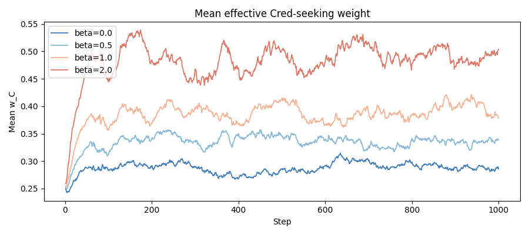
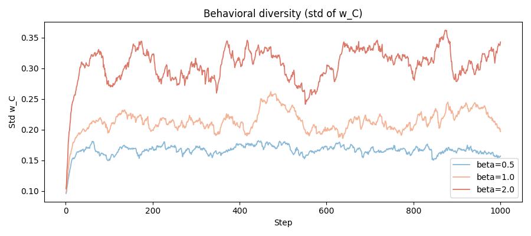
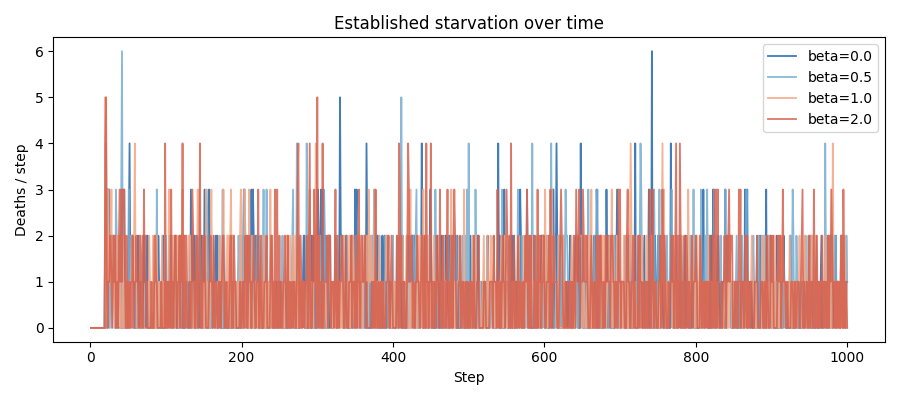
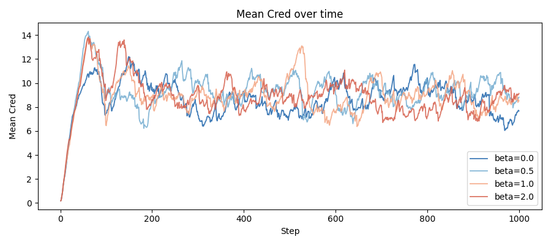
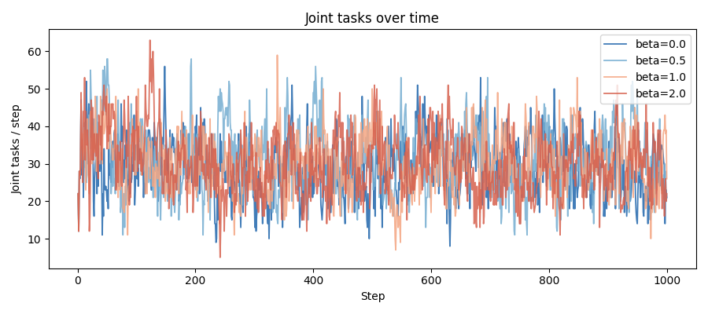

# beta (status amplification) sweep report — Stage 3.2

**Date:** 2026-05-16 | **Seed:** 42 | **Steps:** 1000
**Varied:** status_amplification_beta in {0.0, 0.5, 1.0, 2.0}

beta=0.0 loaded from confirmed Stage 3.1 parquet (f_C=0.25 run,
`outputs/stage3_fC025_seed42/metrics.parquet`). beta=0.5, 1.0, 2.0 run fresh.

## Primary comparison table

| Metric (final 100 steps) | beta=0.0 | beta=0.5 | beta=1.0 | beta=2.0 |
|---|---|---|---|---|
| Mean wealth | 41.0 | 41.2 | 42.4 | 39.3 |
| Gini wealth | 0.463 | 0.469 | 0.471 | 0.461 |
| Spatial dispersion | 17.6 | 18.1 | 17.4 | 18.9 |
| Deaths/step (starvation) | 2.85 | 3.04 | 2.99 | 3.12 |
| Deaths/step (newborn) | 2.25 | 2.25 | 2.19 | 2.33 |
| Deaths/step (established) | 0.60 | 0.79 | 0.80 | 0.79 |
| Mean Cred | 7.555 | 9.579 | 8.134 | 8.506 |
| Gini Cred | 0.684 | 0.691 | 0.687 | 0.693 |
| Mean sigma | 1.194 | 1.284 | 1.219 | 1.237 |
| Joint tasks/step | 25.93 | 32.12 | 28.91 | 29.92 |
| mean_w_C | 0.287 | 0.334 | 0.399 | 0.486 |
| std_w_C | — | 0.164 | 0.229 | 0.310 |
| mean_amplification | — | 1.196 | 1.360 | 1.737 |
| frac_amplified | — | 0.667 | 0.976 | 1.000 |

## Starvation by Cred quartile (deaths / step)

beta=0.0 quartile values confirmed from Stage 3.1 (f_C=0.25 row, 2026-05-16).

| Cred quartile | beta=0.0 | beta=0.5 | beta=1.0 | beta=2.0 |
|---|---|---|---|---|
| Q1 (lowest Cred) | 0.796 | 0.651 | 0.645 | 0.748 |
| Q2 | 0.902 | 1.197 | 1.191 | 1.020 |
| Q3 | 1.116 | 0.999 | 0.977 | 1.081 |
| Q4 (highest Cred) | 0.310 | 0.284 | 0.290 | 0.352 |

## Cred trajectory diagnostic

Linear growth rate of mean_cred in steps 501–1000, normalised per 100 steps.
Runaway threshold: >5% per 100 steps.

- **beta=0.0**: -0.014 per 100 steps after t=500
- **beta=0.5**: +0.008 per 100 steps after t=500
- **beta=1.0**: -0.012 per 100 steps after t=500
- **beta=2.0**: -0.021 per 100 steps after t=500

## Success criteria (§5 of blueprint)

Established starvation threshold: ≤ 0.90/step (1.5× beta=0.0 baseline of 0.60).

- **beta=0.0**: PASS
- **beta=0.5**: PASS
- **beta=1.0**: PASS
- **beta=2.0**: PASS

## Overlay plots

## beta selection guidance

Prefer the value where:
1. No Cred runaway (< 5% growth per 100 steps after t=500)
2. std_w_C > 0.05 — behavioral diversity intact
3. Q4 starvation does not exceed Q3 (utility saturation absent)
4. Established deaths ≤ 1.5× beta=0.0 baseline (0.90/step)
