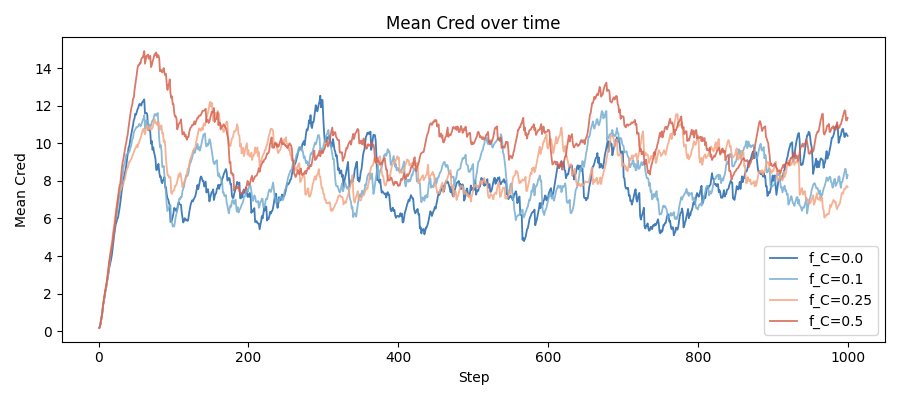
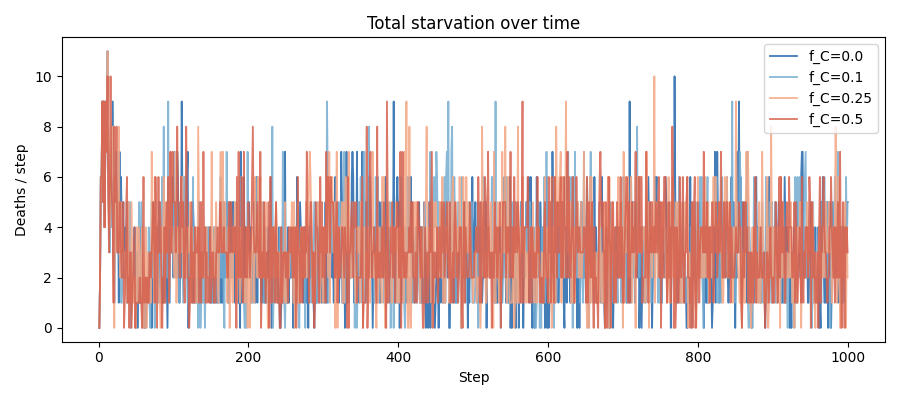
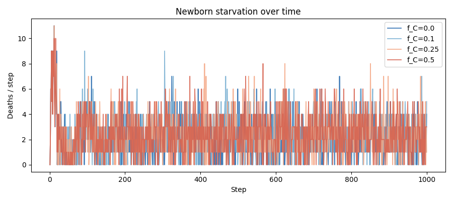
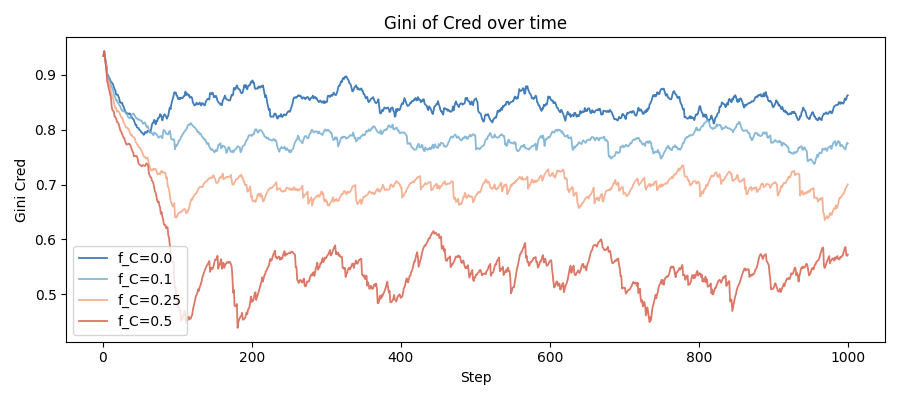

# f_C sweep report — Stage 3.1

**Date:** 2026-05-16 | **Seed:** 42 | **Steps:** 1000
**Varied:** f_C (newborn Cred endowment fraction) in {0.0, 0.1, 0.25, 0.5}

f_C=0.0 and f_C=0.1 loaded from confirmed Stage 3 parquets (not re-run).
f_C=0.25 and f_C=0.5 run fresh with reproducibility confirmation.

## Primary comparison table

| Metric (final 100 steps) | f_C=0.0 | f_C=0.1 | f_C=0.25 | f_C=0.5 |
|---|---|---|---|---|
| Mean wealth | 45.1 | 44.7 | 41.0 | 41.0 |
| Gini wealth | 0.462 | 0.462 | 0.463 | 0.475 |
| Spatial dispersion | 17.8 | 17.8 | 17.6 | 17.8 |
| Deaths/step (starvation) | 2.86 | 2.98 | 2.85 | 3.11 |
| Deaths/step (newborn) | 2.07 | 2.18 | 2.25 | 2.28 |
| Deaths/step (established) | 0.79 | 0.80 | 0.60 | 0.83 |
| Mean Cred | 9.477 | 7.537 | 7.555 | 10.003 |
| Gini Cred | 0.834 | 0.765 | 0.684 | 0.548 |
| Max Cred fraction | 0.069 | 0.064 | 0.065 | 0.055 |
| Mean sigma | 1.051 | 1.105 | 1.194 | 1.531 |
| Joint tasks/step | 39.46 | 29.21 | 25.93 | 26.65 |
| mean_w_C | 0.290 | 0.288 | 0.287 | 0.279 |

## Starvation by Cred quartile (deaths / step)

Quartile boundaries from population Cred distribution. f_C=0.0 and f_C=0.1
values are confirmed from Stage 3 execution (2026-05-16).

| Cred quartile | f_C=0.0 | f_C=0.1 | f_C=0.25 | f_C=0.5 |
|---|---|---|---|---|
| Q1 (lowest Cred) | 2.129 | 0.887 | 0.796 | 0.579 |
| Q2 | 0.005 | 0.880 | 0.902 | 1.235 |
| Q3 | 0.426 | 0.982 | 1.116 | 1.009 |
| Q4 (highest Cred) | 0.288 | 0.288 | 0.310 | 0.375 |

## Cred trajectory diagnostic

Linear growth rate of mean_cred in steps 501–1000, normalised per 100 steps.
Threshold for runaway: >5% per 100 steps.

- **f_C=0.0**: growth rate +0.053 per 100 steps after t=500 ** RUNAWAY **
- **f_C=0.1**: growth rate -0.019 per 100 steps after t=500
- **f_C=0.25**: growth rate -0.014 per 100 steps after t=500
- **f_C=0.5**: growth rate -0.014 per 100 steps after t=500

## Watch metrics

**Gini Cred watch (threshold 0.6):**
  - f_C=0.5: Gini Cred = 0.548 ** BELOW 0.6 — Matthew effect weakened **

## Overlay plots

## f_C selection guidance

Selection criteria (all must hold):
1. No Cred runaway (growth < 5% per 100 steps after t=500)
2. Gini Cred > 0.6 (Matthew effect intact)
3. Joint tasks/step > 25 (Cred engine firing)
4. Total starvation not catastrophically above f_C=0.0 baseline (2.86/step)
