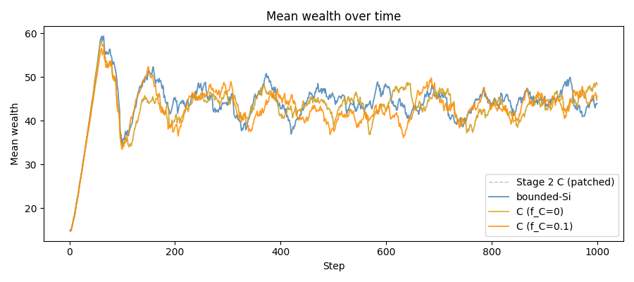
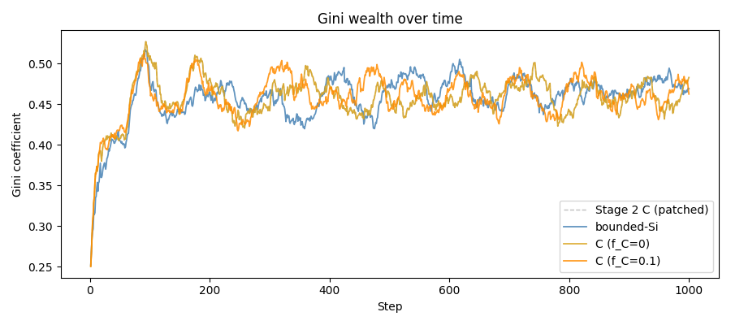
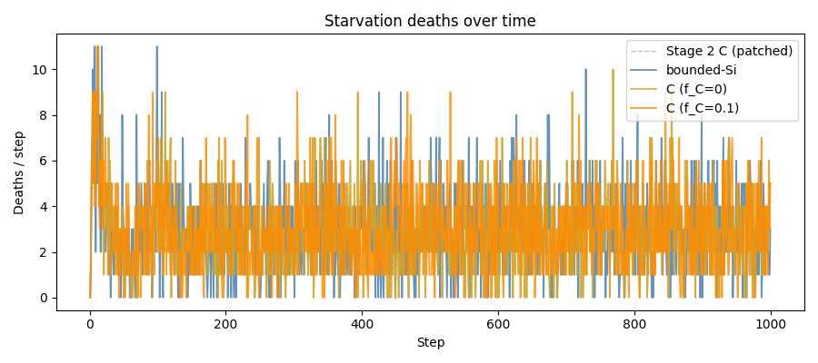
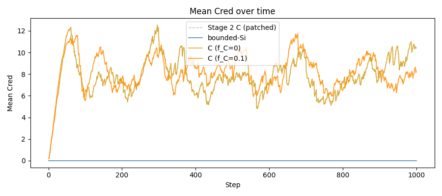
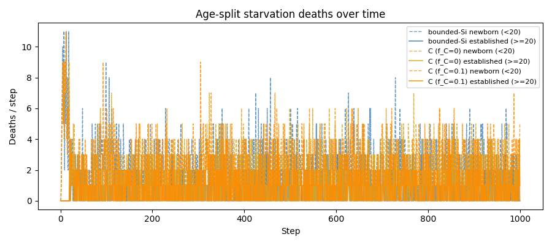
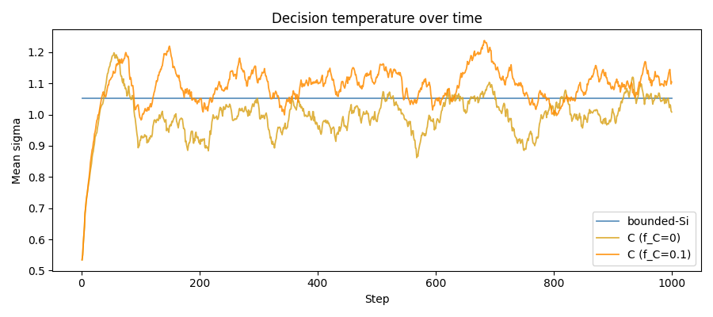

# Stage 3 Report — Variance-matched Si vs C comparison

**Date:** 2026-05-16 | **Seed:** 42 | **Steps:** 1000
**Strategy:** bounded-Si (sigma_Si=1.051) vs C (kappa=2.0, f_C=0 and f_C=0.1)

## Experimental design

Three runs in strict order (no Stage 2 directories overwritten):

1. **bounded-Si** (`stage3_si_bounded_seed42`) — Sugarscape with fixed softmax temperature
   sigma_Si=1.051 (calibrated from Stage 2.2 kappa=2.0 mean_sigma). No Cred, no joint tasks
   paid in Cred. Serves as the variance-matched baseline — same exploration noise as C.

2. **C no-endowment** (`stage3_carbon_no_endowment_seed42`) — Full carbon-C model with
   f_C=0.0 (newborns start at cred=0). Isolates the endowment effect from the strategy effect.

3. **C canonical** (`stage3_carbon_seed42`) — Full carbon-C with f_C=0.1 (newborns endowed
   with 10% of mean Cred at birth). Canonical Stage 3 C configuration.

The primary question: does the C vs Si starvation difference survive variance-matching?
The secondary question: does newborn Cred endowment reduce newborn starvation?

## Four-way comparison table

| Metric (final 100 steps) | Stage 2 C (patched) | bounded-Si | C (f_C=0) | C (f_C=0.1) |
|---|---|---|---|---|
| Mean wealth | 45.1 | 44.8 | 45.1 | 44.7 |
| Gini wealth | 0.462 | 0.474 | 0.462 | 0.462 |
| Spatial dispersion | 17.8 | 18.3 | 17.8 | 17.8 |
| Deaths/step (starvation) | 2.86 | 2.96 | 2.86 | 2.98 |
| Deaths/step (senescence) | 2.43 | 2.41 | 2.43 | 2.53 |
| Deaths/step (newborn) | — | 2.04 | 2.07 | 2.18 |
| Deaths/step (established) | — | 0.92 | 0.79 | 0.80 |
| Mean Cred | 9.477 | 0.000 | 9.477 | 7.537 |
| Gini Cred | 0.834 | 0.000 | 0.834 | 0.765 |
| Max Cred fraction | 0.069 | 0.000 | 0.069 | 0.064 |
| Mean sigma | 1.051 | 1.051 | 1.051 | 1.105 |
| Joint tasks/step | 39.46 | 27.72 | 39.46 | 29.21 |
| mean_w_C | 0.290 | 0.000 | 0.290 | 0.288 |
| frac_suppressed | 0.001 | 0.000 | 0.001 | 0.000 |

## Starvation by Cred quartile (deaths / step)

| Cred quartile | bounded-Si | C (f_C=0) | C (f_C=0.1) |
|---|---|---|---|
| Q1 (lowest Cred) | 2.962 | 2.129 | 0.887 |
| Q2 | 0.000 | 0.005 | 0.880 |
| Q3 | 0.000 | 0.426 | 0.982 |
| Q4 (highest Cred) | 0.000 | 0.288 | 0.288 |

## Age-split starvation (final 100 steps)

| Cohort | bounded-Si | C (f_C=0.1) | Delta |
|---|---|---|---|
| Newborn (age<20) | 2.040 | 2.180 | +0.140 |
| Established (age>=20) | 0.920 | 0.800 | -0.120 |

## Plots

### Metric overlays (three Stage 3 runs + Stage 2 C reference)

### Age-split starvation

### Decision temperature

## Interpretation notes

- If C starvation > Si starvation after variance-matching, the mechanism (Cred inequality,
  joint-task access) is the driver — not raw exploration noise.
- If C newborn starvation drops with f_C=0.1 vs f_C=0.0, the endowment works as intended.
- Established-cohort delta is the cleaner signal: older agents have accumulated Cred and the
  endowment effect is diluted; any persistent excess reflects the Matthew effect.
