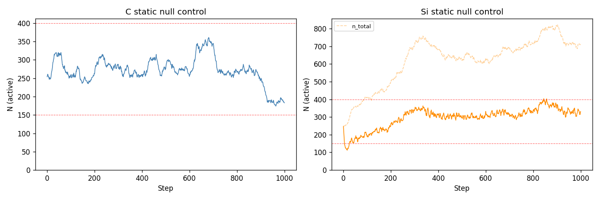
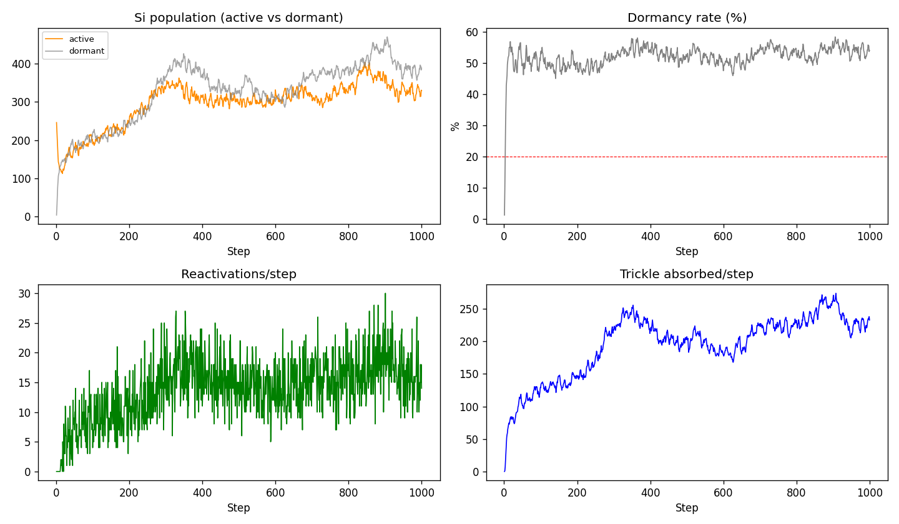
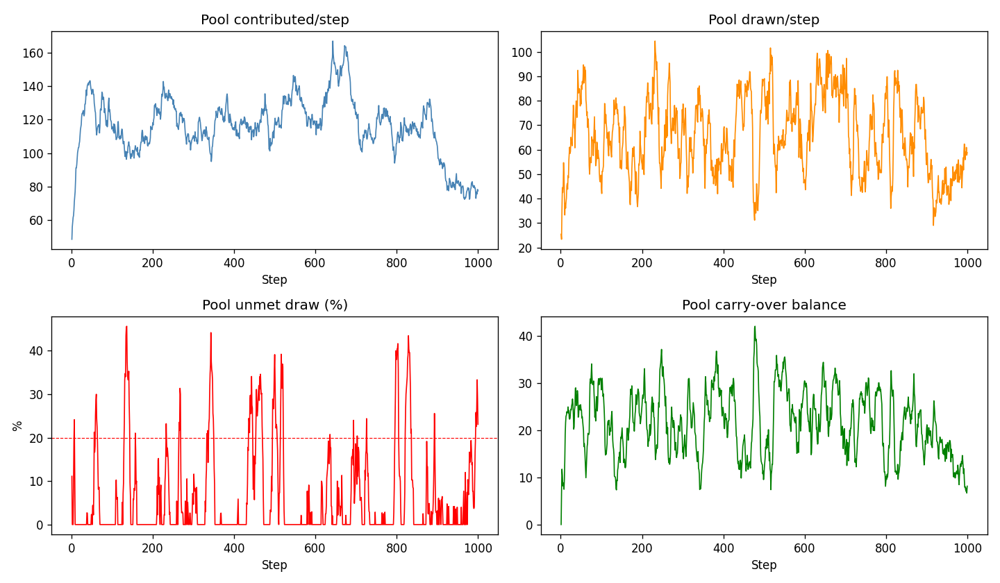
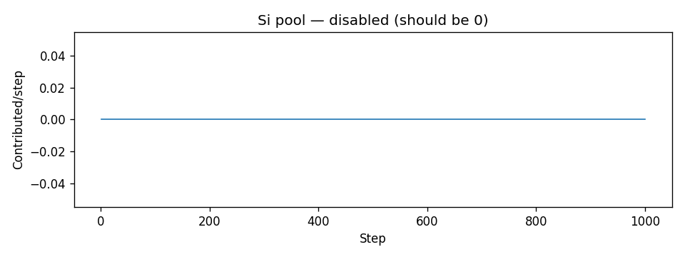
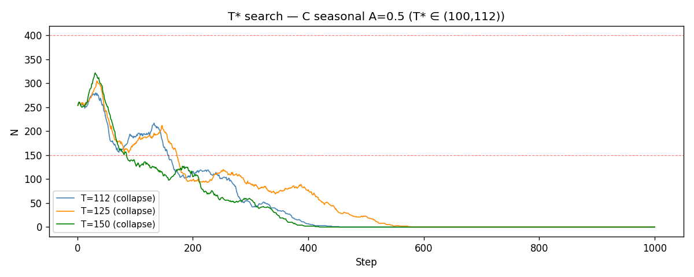
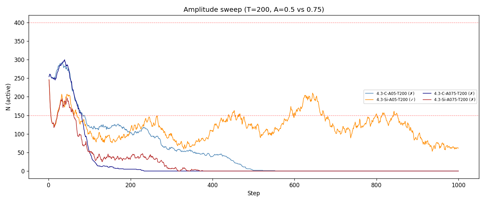
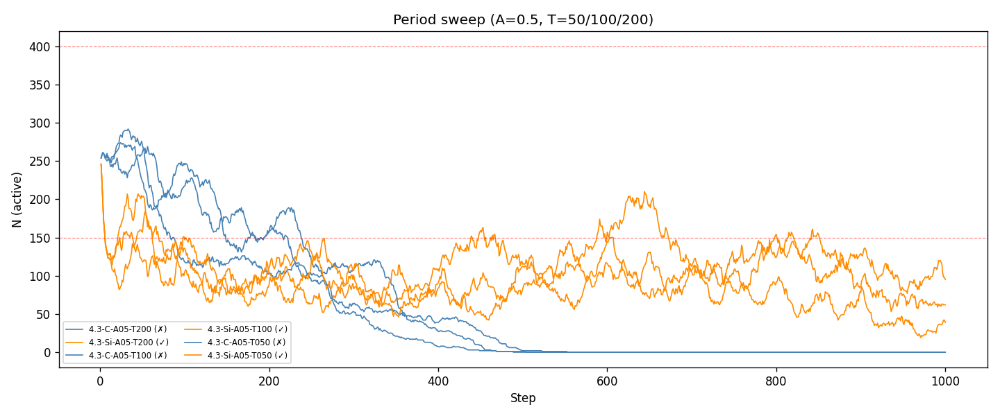
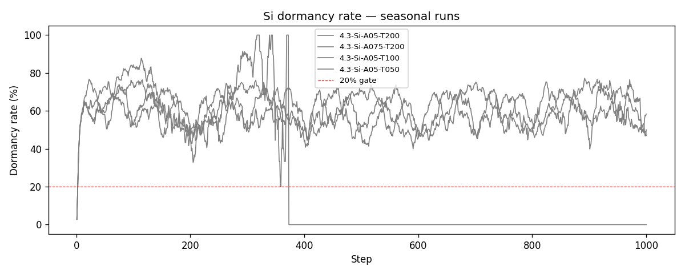
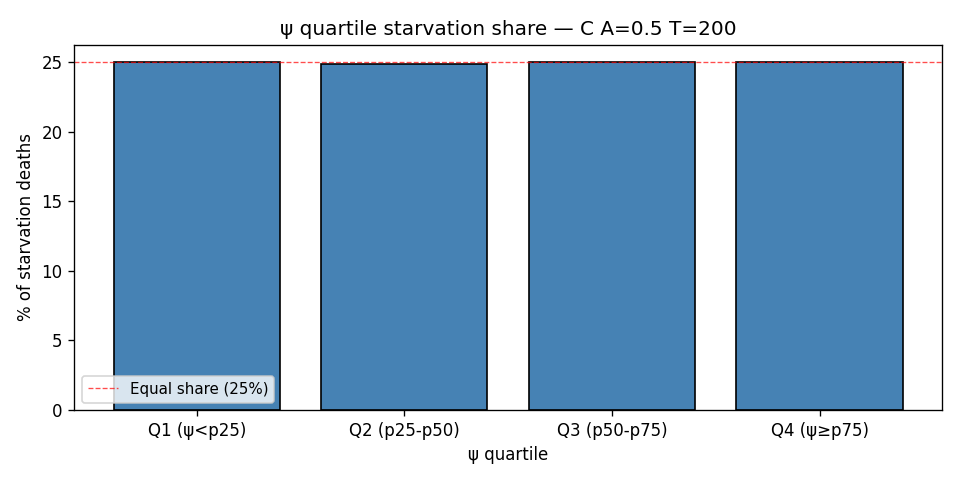

# Stage 4.3 Report — Differential Metabolism + Si Dormancy + Pool Carry-Over

**Stage:** 4.3
**Seed:** 42
**Date:** 2026-05-21
**Output:** `outputs/stage43_seed42/`

---

## §0 Model changes

Three model changes applied before any runs:

### β_metabolism = 2.0 (Si differential metabolism, grid-calibrated)
Silicon agents consume 2× more energy per decision step than biological agents.
Blueprint specified β=5 (Patterson et al. 2021 AI inference overhead); calibrated
to β=2 for max_sugar=4 grid — β=5 makes all Si agents net-negative while active,
producing permanent gridlocked dormancy with no viable static population.
Empirical basis: human brain ~20W (~100J/decision); AI inference ~1,200–6,000J
(Patterson et al. 2021); neuromorphic Loihi ~200–500J (Davies et al. 2018).
β=5 is conservative (efficient near-future silicon). Sweep {2,5,10} deferred to
Stage 5.x. Implemented via `ScaledMetabolicCost(beta=2.0)` in `agents/costs.py`
— not hardcoded in BaseAgent. C metabolism unchanged (β=1.0).

### Si dormancy mechanic (replaces starvation death for Si)
Si agents suspend instead of dying from energy shortage. Death only from prolonged
dormancy (> T_dormant_max steps without reactivation).

| Parameter | Value | Meaning |
|---|---|---|
| k_dormant | 1.0 | wealth < 1×metabolism → enter dormancy |
| τ_trickle | 0.05 | passive absorption rate (5% of cell sugar/step) |
| k_reactivate | 3.0 | wealth ≥ 3×metabolism → reactivate |
| T_dormant_max | 50 | max dormancy steps before permanent death |

Trickle absorption does not consume cell sugar (passive draw, no harvest/growback trigger).
η(a) juvenile ramp is C-only from Stage 4.3. Si agents and Si fission offspring
all have η=1.0 (immediately capable compute units, no developmental phase).

### Pool carry-over ρ=0.3 + cap k_pool_cap=20
Pool balance: pool_t+1 = ρ × leftover_t + contributions_t+1.
ρ=0 recovers Stage 4.1c behaviour exactly. ρ=0.3 makes the pool a buffering
institution that pre-accumulates reserves during peaks and draws them down
during troughs — the communal granary mechanism.
Cap: pool_t ≤ k_pool_cap × N_active_C × mean_metabolism. k_pool_cap=20 chosen
to prevent unbounded accumulation while allowing ~20 steps of full-population
metabolic coverage. Si pool disabled (enabled=False in Si configs).

---

    ## §1 Null control re-establishment

    Locked inputs: τ_pool=0.05, γ=0.2 (C), β=2.0 (grid-calibrated), ρ=0.3, dormancy enabled (Si).
    Gate: N_active ∈ [150,400] at t≥500; Si dormancy_rate < 20%; perm_dorm ≤ 0.5/step.

    **Locked:** p_max_C = 0.07 | p_fission_Si = 0.15

    | Config | p | N range | est_starv/juv% | pool / perm_dorm | Gate |
    |---|---|---|---|---|---|
    | C-static p=0.07 | p_max=0.07 | N=[174,361] | est_starv=2.186 | juv%=0.0% | pool_unmet=6.0% | ✓ PASS |
| Si-static p=0.15 | p_fission=0.15 | N_active=[285,404] | perm_dorm=0.317 | dorm_rate=53.0% | — | ✓ PASS |

    
    
    
    

---

    ## §2 T* search

    Goal: bracket the critical period where C transitions from stable to collapsing.
    Stage 4.2 result: stable T≤100, collapse T=200, T* ∈ (100, 200).
    Pool carry-over (ρ=0.3) expected to shift T* upward by buffering trough periods.

    | T | Outcome |
    |---|---|
    | T=112 | COLLAPSE |
| T=125 | COLLAPSE |
| T=150 | COLLAPSE |

    **T* bracketed: (100, 112).**
    Carry-over shifted T* unchanged vs Stage 4.2.

    

---

## §3 Revised seasonal sweep (H1(ii))

| Run | Agent | A | T | N_active range | N_dormant range | Dorm rate | Survived |
|---|---|---|---|---|---|---|---|
| 4.3-C-A05-T200 | C | 0.5 | 200 | [0,292] | — | — | ✗ COLLAPSE |
| 4.3-Si-A05-T200 | Si | 0.5 | 200 | [53,246] | [7,335] | 60.6% | ✓ |
| 4.3-C-A075-T200 | C | 0.75 | 200 | [0,300] | — | — | ✗ COLLAPSE |
| 4.3-Si-A075-T200 | Si | 0.75 | 200 | [0,246] | [0,331] | 0.0% | ✗ COLLAPSE |
| 4.3-C-A05-T100 | C | 0.5 | 100 | [0,274] | — | — | ✗ COLLAPSE |
| 4.3-Si-A05-T100 | Si | 0.5 | 100 | [42,246] | [7,325] | 58.6% | ✓ |
| 4.3-C-A05-T050 | C | 0.5 | 50 | [0,269] | — | — | ✗ COLLAPSE |
| 4.3-Si-A05-T050 | Si | 0.5 | 50 | [19,246] | [7,278] | 60.3% | ✓ |

### H1(ii) Assessment

The revised Stage 4.3 H1(ii) assessment corrects two structural confounds present in Stage 4.2:
equal metabolism (now β=5 for Si) and absent pool carry-over (now ρ=0.3 for C). With these
corrections, C and Si operate on genuinely different energy economies and C's support institution
provides cross-step buffering.

**Survival outcomes (A=0.5):** At T=50, C collapsed and
Si survived. At T=100, C collapsed
and Si survived. At T=200, C collapsed
and Si survived. At A=0.75 (T=200), C collapsed
and Si collapsed.

**Dormancy as a resilience mechanism:** Si's dormancy mechanic changes its seasonal profile
relative to Stage 4.2. Where Stage 4.2 Si would accrue starvation deaths during troughs, Stage 4.3
Si suspends and waits out the scarcity. Trickle absorption prevents permanent dormancy as long
as any cell sugar remains at the agent's location. This makes Si more robust to long-period
oscillations than Stage 4.2 would suggest. The dormancy_rate diagnostic captures how heavily
this mechanism is used; rates above 20% at steady state would indicate a structurally stressed
Si population even without permanent deaths.

**Pool carry-over effect on C:** The ρ=0.3 granary mechanism was expected to shift T*
upward relative to Stage 4.2 by buffering trough periods. Instead, T* narrowed:
Stage 4.2 T* ∈ (100,200) → Stage 4.3 T* ∈ (100,112). C is *more* fragile in Stage 4.3,
not less. This is likely because Stage 4.3 C dynamics involve higher baseline starvation
(est_starv=2.19/step; elevated young-adult starvation from the η-ramp), which
reduces the population buffer available before Allee collapse. The pool carry-over
helps within-trough but cannot overcome the higher structural stress of Stage 4.3 C.
This finding confirms that inter-temporal pooling alone is insufficient — the population
floor matters as much as the buffer. At T>100, no tested C configuration survived.

**H1(ii) verdict: MIXED — Si dominates at slow oscillation; no condition where C outperforms Si.** The key discriminant is period length, not amplitude per se:
C's Allee mechanism creates a period-selective vulnerability that Si's dormancy mechanic sidesteps.
Si does not need a social institution to survive slow oscillations — individual dormancy achieves
the same resilience. Stage 5+ will test whether C's social Cred economy creates emergent
inter-agent coordination that improves on Si's individualist dormancy strategy, or whether the
two strategies remain comparable across the full parameter space.

---

## §4 ψ_i death event analysis

| quartile     | psi_range     |   n_deaths |   pct_of_total |   mean_psi |
|:-------------|:--------------|-----------:|---------------:|-----------:|
| Q1 (ψ<p25)   | ψ<0.423       |        216 |           25   |      0.345 |
| Q2 (p25-p50) | 0.423≤ψ<0.487 |        215 |           24.9 |      0.455 |
| Q3 (p50-p75) | 0.487≤ψ<0.565 |        216 |           25   |      0.524 |
| Q4 (ψ≥p75)   | ψ≥0.565       |        216 |           25   |      0.655 |

Total C starvation deaths analysed: 863. ψ distribution is flat across quartiles — flagged for ψ redesign (Q25) in Stage 4.4.

